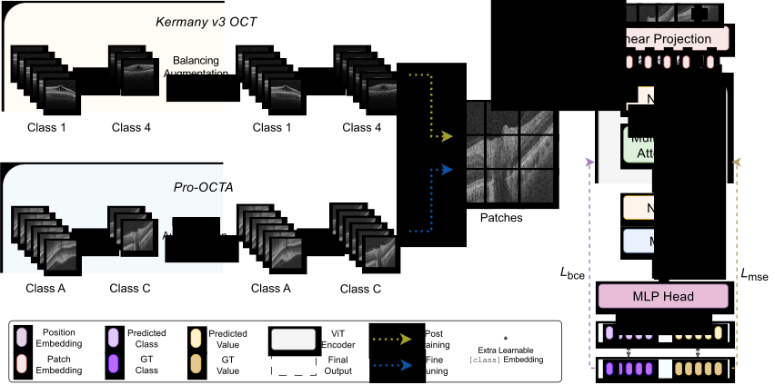

<div align="center"><h1> JointViT: Modeling Oxygen Saturation Levels with Joint Supervision on Long-Tailed OCTA <br>
  <sub><sup><a href="https://miua2024.github.io/">MIUA 2024 Oral</a></sup></sub> 
</h1>

[Zeyu Zhang](https://steve-zeyu-zhang.github.io), [Xuyin Qi](https://www.linkedin.com/in/xuyin-q-29672524a/), [Mingxi Chen](https://www.linkedin.com/in/mingxi-chen-4b57562a1/), [Guangxi Li](https://github.com/lgX1123), [Ryan Pham](https://www.flinders.edu.au/people/ryan.pham), [Ayub Qassim](https://www.flinders.edu.au/people/ayub.qassim), [Ella Berry](https://www.linkedin.com/in/ella-berry-a2a3aab4/), [Zhibin Liao](https://researchers.adelaide.edu.au/profile/zhibin.liao), [Owen Siggs](https://researchnow.flinders.edu.au/en/persons/owen-siggs-2), [Robert Mclaughlin](https://researchers.adelaide.edu.au/profile/robert.mclaughlin), [Jamie Craig](https://www.flinders.edu.au/people/jamie.craig), [Minh-Son To](https://www.flinders.edu.au/people/minhson.to)

[](https://steve-zeyu-zhang.github.io/JointViT/) [](https://arxiv.org/abs/2404.11525) [](https://paperswithcode.com/paper/jointvit-modeling-oxygen-saturation-levels) [](https://steve-zeyu-zhang.github.io/JointViT/static/scholar.html)

</div>

_The oxygen saturation level in the blood (SaO<sub>2</sub>) is crucial for health, particularly in relation to sleep-related breathing disorders. However, continuous monitoring of SaO<sub>2</sub> is time-consuming and highly variable depending on patients' conditions. Recently, optical coherence tomography angiography (OCTA) has shown promising development in rapidly and effectively screening eye-related lesions, offering the potential for diagnosing sleep-related disorders. To bridge this gap, our paper presents three key contributions. Firstly, we propose <b>JointViT</b>, a novel model based on the Vision Transformer architecture, incorporating a <b>joint loss</b> function for supervision. Secondly, we introduce a <b>balancing augmentation</b> technique during data preprocessing to improve the model's performance, particularly on the long-tail distribution within the OCTA dataset. Lastly, through comprehensive experiments on the OCTA dataset, our proposed method significantly outperforms other state-of-the-art methods, achieving improvements of up to <b>12.28%</b> in overall accuracy. This advancement lays the groundwork for the future utilization of OCTA in diagnosing sleep-related disorders._



## News

<b>(06/18/2024)</b> &#127881; Our paper has been selected as <b>oral presentation</b> at <a href="https://miua2024.github.io/"><b>MIUA 2024</b></a>!


<b>(05/14/2024)</b> &#127881; Our paper has been accepted to <a href="https://miua2024.github.io/"><b>MIUA 2024</b></a>!

## Code coming soon!

## Citation

```
@article{zhang2024jointvit,
  title={JointViT: Modeling Oxygen Saturation Levels with Joint Supervision on Long-Tailed OCTA},
  author={Zhang, Zeyu and Qi, Xuyin and Chen, Mingxi and Li, Guangxi and Pham, Ryan and Zuhair, Ayub and Berry, Ella and Liao, Zhibin and Siggs, Owen and Mclaughlin, Robert and others},
  journal={arXiv preprint arXiv:2404.11525},
  year={2024}
}
```
